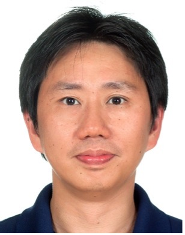

Speaker: **Prof. Phone Lin**.
IEEE Fellow and IEEE VTS Distinguished Speaker, Distinguished Professor, Department of Computer Science and Information Engineering, National Taiwan University
<!--more-->

## Abstract 

Anomaly detection/prediction usually relies on wide domain knowledge to build up the tools to automatically detect/predict abnormal events or behaviors of an IoT system. An IoT system may consist of machines with different capabilities, functionalities and ages. Abnormal events or behaviors are usually rare events. It is time-consuming and high-cost to build up the domain knowhow of the IoT systems and collect enough data points of the anomaly. In this lecture, I first identify the issues and challenges. Then I illustrate a general environment for anomaly detection/perdition. Then I will illustrate the technologies and solutions for anomaly detection/prediction, and show some prototypes and their applications.

## Biography

Phone Lin received his B.S. and Ph.D. degrees in Computer Science and Information Engineering from National Chiao Tung University, Hsinchu, Taiwan, in 1996 and 2001, respectively. He is currently a Distinguished Professor at National Taiwan University, where he holds a professorship within the Department of Computer Science and Information Engineering, Graduate Institute of Networking and Multimedia, and Internet of Things Research Center, College of EECS, and Graduate Institute of Medical Device and Imaging, College of Medicine. He served as the Chair of IEEE Vehicular Technology Society Taipei Chapter from 2014 to 2015. He serves on the editorial boards of several journals, such as the IEEE Wireless Communications and the IEEE Internet of Things Journal. In recognition of his research contributions, he has received numerous awards, such as the Outstanding Research Award from the Ministry of Science and Technology, Taiwan, in 2016, and the Best Young Researcher of IEEE ComSoc Asia-Pacific Young Researcher Award in 2007. He is a Fellow of IEEE. 

