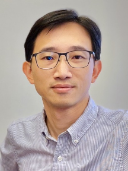

Speaker: **Prof. Chih-Wei Huang**.
Professor, Department of Communication Engineering, National Central University, Taiwan
<!--more-->

## Abstract 

This talk examines recent advancements in wireless networks, emphasizing their ability to support complex applications such as high-speed data transmission in multiple-input multiple-output (MIMO) systems and engaging experiences in mixed reality (MR) applications. We will discuss two research contributions that introduce innovative solutions in these fields. The first research project presents a cutting-edge framework that employs deep reinforcement learning (DRL) to optimize cross-layer resource allocation. Instead of directly assigning execution parameters, the framework automates algorithm selection based on real-time traffic conditions, resulting in improved user satisfaction rates compared to traditional cross-layer adaptation techniques. The second study investigates a remote rendering architecture specifically designed for MR applications. By incorporating localization-assisted approaches, this architecture effectively reduces streaming data volume while maintaining accurate object rendering, enabling immersive and engaging MR experiences. 

## Biography

Dr. Chih-Wei Huang earned his B.S. from National Taiwan University in 2001, M.S. from Columbia University in 2004, and Ph.D. from University of Washington in 2009, all in electrical engineering. He is currently a Professor and heads the Information Processing and Communications (IPC) laboratory at the Department of Communication Engineering, National Central University in Taiwan. Prior to joining academia, he worked as an intern researcher at Siemens Corporate Research and Microsoft Research between 2006 and 2009. His research interests span wireless networking, multimedia communications, machine learning, digital signal processing, and information retrieval. Dr. Huang's contributions have been recognized with best paper awards from several conferences, including IEEE ICCE 2020, IEEE ICC 2018, and WOCC 2015. 

